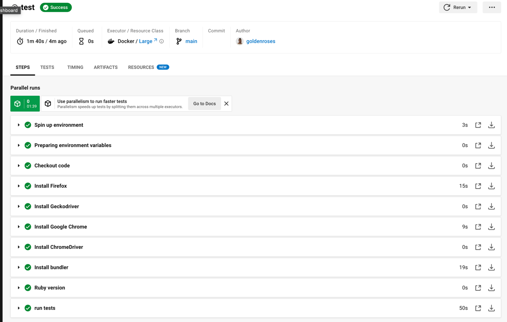

## Rspec Capybara Demo
A sample of running spec capybara tests.

### Running the test
```bin/rspec spec/sauce_demo.rb```

## BrowserStack Results
Login to browser stack and check results on the automate panel, 
you would see results similar to the following.


## Circle CI reports
Circle CI provides a step-by step result that should output the below


## Allure Reports
View your reports by typing the following command
``allure serve reports/allure-results ``

#### Expected Results

